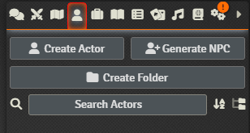
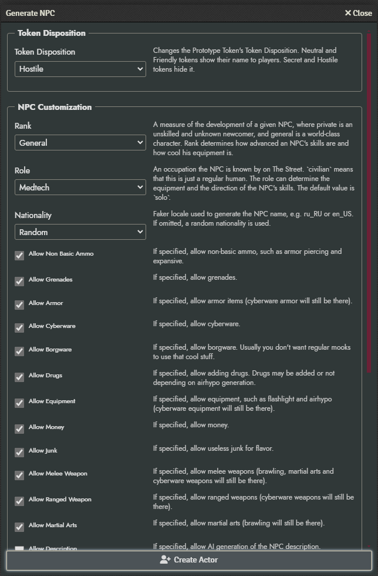
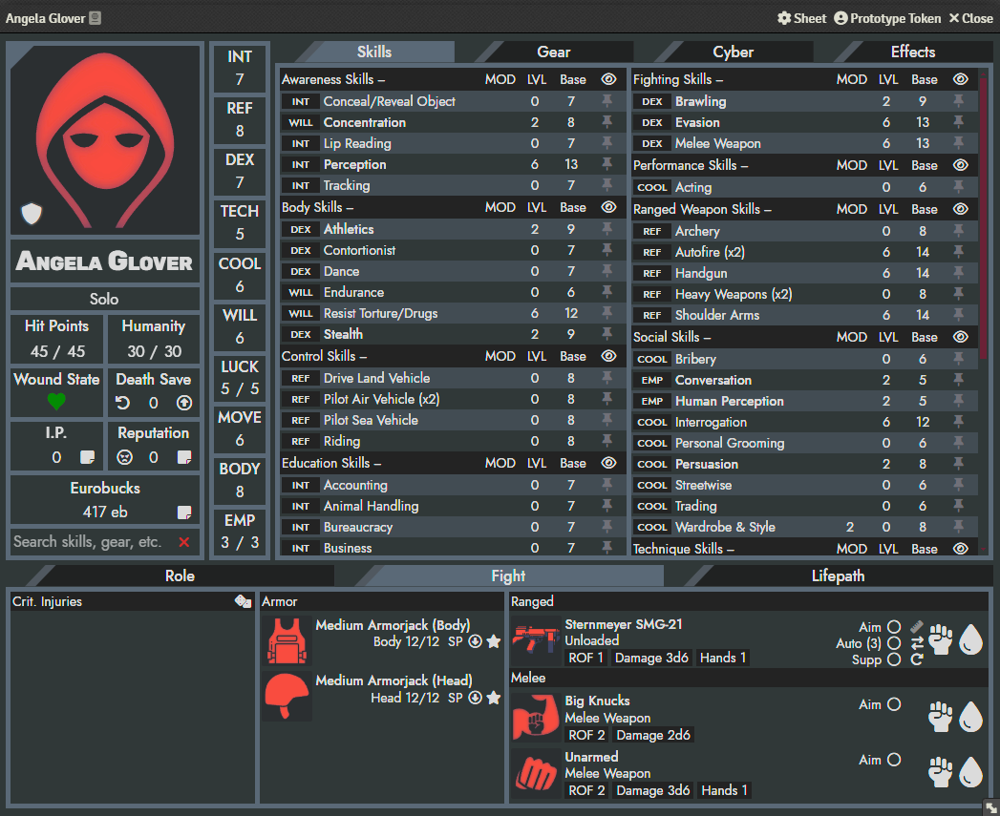
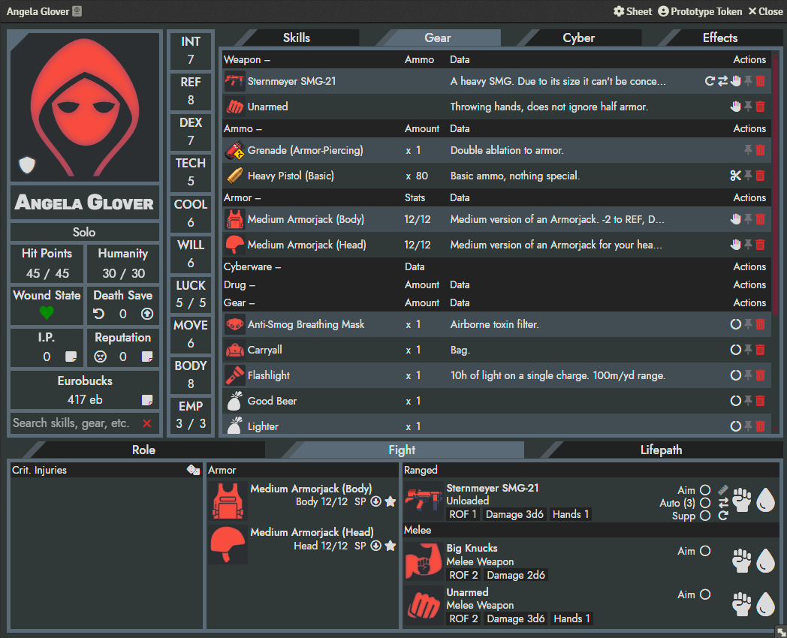
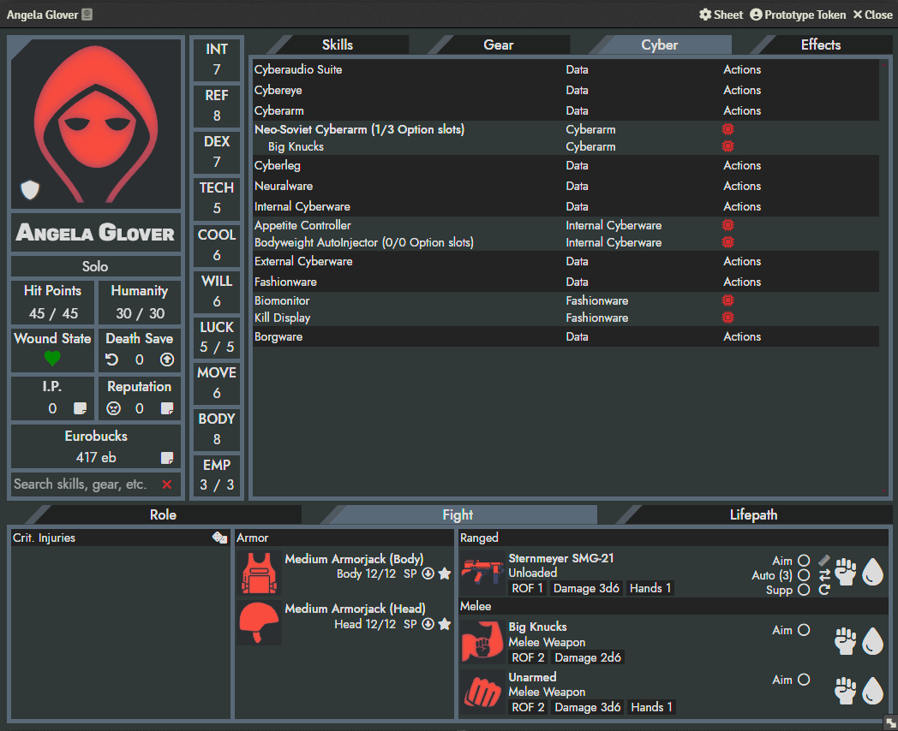
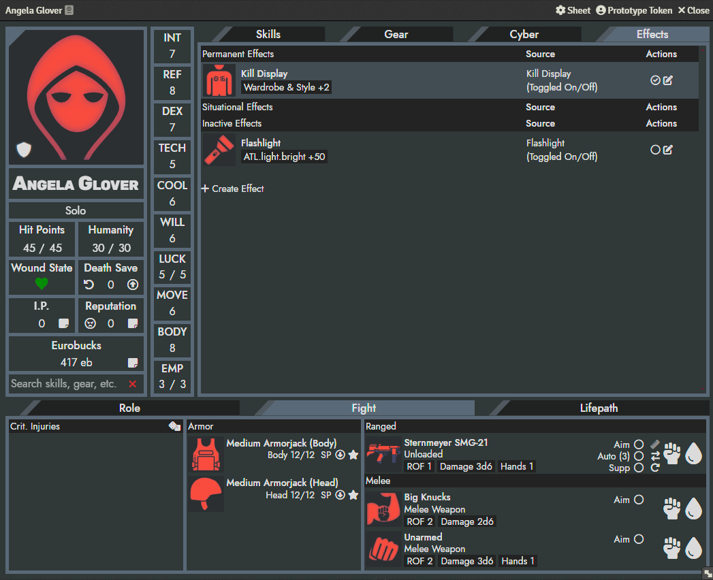
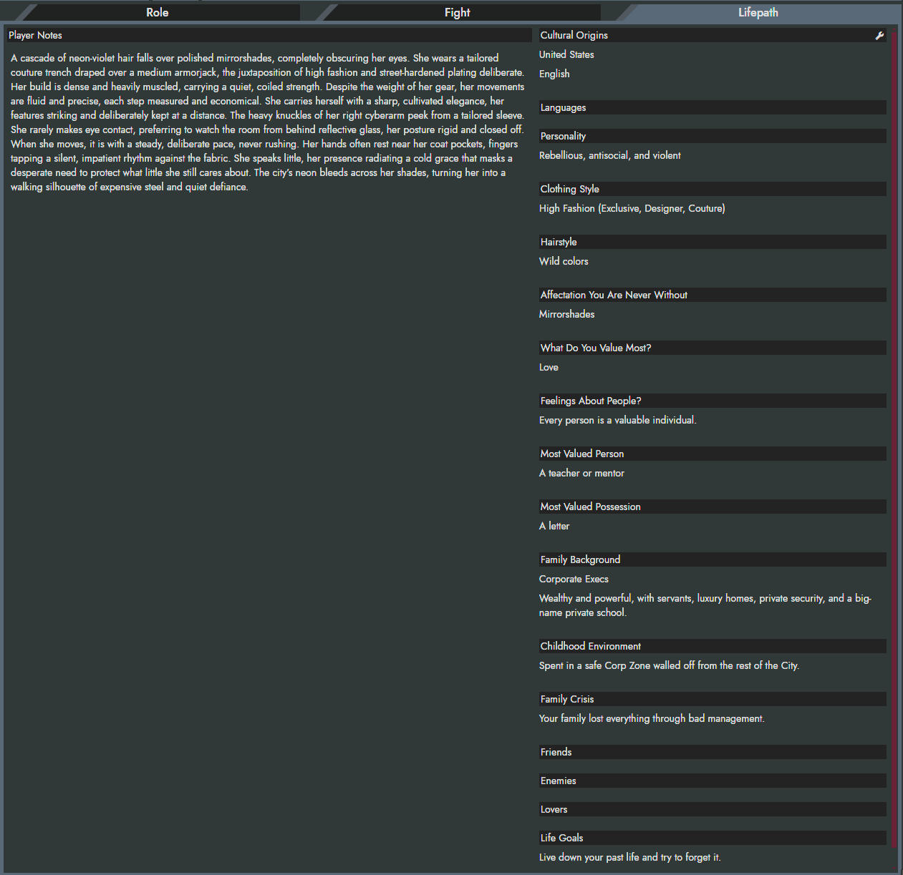

# NPC Generator - Foundry Module

A Foundry Virtual Tabletop module that generates and imports ready-to-use
non-player characters for the Cyberpunk RED game system.

[](https://foundryvtt.com/)
[](https://foundryvtt.com/packages/cyberpunk-red-core)
[](https://github.com/n0lavar/npc-generator-for-cp-red-foundry/releases/latest)
[](https://github.com/n0lavar/npc-generator-for-cp-red-foundry/actions/workflows/release.yml)
[](https://github.com/n0lavar/npc-generator-for-cp-red-foundry/releases)
[](https://www.gnu.org/licenses/gpl-3.0)

[](https://www.patreon.com/cw/n0lavar)
[](https://buymeacoffee.com/n0lavar)

The module runs the
[NPC generator](https://github.com/n0lavar/cp_red_npc_generator)
from inside Foundry, translates its output into Cyberpunk RED Actor and Item
documents, and creates the NPC in the active world.

> This project is a Foundry integration for the generator. Generator rules,
> character generation logic, and generator configuration are maintained in
> the main generator repository linked above.

## What the Module Does

- Adds a **Generate NPC** button to the Actor Directory for GMs.  

- Provides a dialog for selecting the NPC rank, role, and generation options.  

- Runs the Python generator in the browser through Pyodide.
- Creates a Cyberpunk RED character Actor from the generated data.
- Imports generated stats, skills, role data, cyberware, armor, weapons,
  ammunition, equipment, junk, and money.
- Resolves supported equipment from every available Item compendium, including
  content provided by other installed modules.
- Clones complete compendium Items so system icons, effects, metadata, and
  schema defaults are retained.
- Equips imported armor and weapons and updates tracked armor locations.
- Checks the current world for generator compatibility and excludes skills
  that are unavailable in the installed system and compendiums.
- Reports generated entries that cannot be matched instead of silently
  discarding them.

## Balance

For details, see the [generator repository](https://github.com/n0lavar/cp_red_npc_generator).

| Rank number | Rank name          | Combat number | Description                     |
|-------------|--------------------|---------------|---------------------------------|
| 0           | private            | 7-9           | weak boosters                   |
| 1           | corporal           | 8-10          | boosters                        |
| 2           | lieutenant         | 10-13         | starter edgerunners             |
| 3           | captain            | 12-14         | advanced edgerunners, police    |
| 4           | lieutenant_colonel | 13-16         | high profile gangs, local corps |
| 5           | lieutenant_general | 16-17         | megacorps, military, mafia      |
| 6           | general            | 17-18         | MaxTac, special forces, legends |

## Usage

1. Open the **Actors** directory as a GM.
2. Select **Generate NPC**.
3. Choose the rank, role, and other generation settings.
4. Select **Create Actor**.
5. Wait for generation and import to complete.

Generation settings are initialized from `settings.example.json`. Changes made
in the dialog are stored as browser-private data for the current Foundry
origin; the installed module directory is not modified at runtime.

  
  
  
  
  

## Installation

In Foundry VTT, open **Add-on Modules**, select **Install Module**, and paste
this manifest URL:

```text
https://raw.githubusercontent.com/n0lavar/npc-generator-for-cp-red-foundry/master/module.json
```

## Generator Modes

The module provides two GM-only execution modes.

### Bundled

Uses the generator wheel packaged in `vendor/wheels/`. This is the normal mode
for module users.

### Developer

Prompts for a local checkout of the main generator project and imports its
current Python source directly through the browser File System Access API. Use
this mode when developing both projects together.

The current Developer mode source and its representative output define the
supported generator contract.

## Compatibility Check

When a GM's world becomes ready, the module compares the generator's supported
skills and equipment with the Cyberpunk RED system and all available Item
compendiums. Missing skills are saved as generation defaults and excluded from
later NPC generation.

Run **Check compatibility** from the module settings whenever the system,
generator, or installed content modules change.

## Optional AI Descriptions with LM Studio

The generator can request descriptions from an OpenAI-compatible LM Studio
server. Because generation runs in the browser, LM Studio must accept
cross-origin requests from Foundry.

In LM Studio, open **Developer > Server Settings**, enable **Enable CORS**, and
restart the server. Alternatively:

```powershell
lms server stop
lms server start --cors
```

Foundry commonly runs at `http://localhost:30000`, while LM Studio commonly
runs at `http://localhost:1234/v1`. Without CORS, the browser blocks the
request. Leaving the Model ID, API key, or base URL empty disables AI-generated
descriptions.

## Updating the Bundled Generator

To package a published generator tag:

```console
python tools/update-bundled-generator.py <tag>
```

The update script verifies the tag, builds and validates the wheel, updates the
worker reference, and removes the previous wheel only after the replacement is
ready.

## Troubleshooting

- If the generator appears slow on first use, allow time for Pyodide and Python
  dependencies to download.
- If an Item is reported as unmatched, verify that an Item with the expected
  name and type exists in an enabled compendium.
- If available content has changed, run **Check compatibility** again.
- If Developer mode cannot load the project, select the current
  `cp_red_npc_generator` project directory again.
- If LM Studio requests fail, verify its server URL and CORS setting.

Technical errors are written to the browser console with the `NPC Generator |`
prefix.

## Links

- [NPC Generator](https://github.com/n0lavar/cp_red_npc_generator)

## License

The original source code of this project is licensed under GNU GPLv3.

### Third-party intellectual property

This tool is not intended to replace the Cyberpunk RED Core Rulebook.

Cyberpunk, Cyberpunk RED, Night City, and related names, terminology, game data, and other intellectual property belong to R. Talsorian Games and/or their respective licensors. Such material is not licensed under GNU GPLv3 by this repository.

NPC Generator Foundry Module is unofficial content provided under the Homebrew Content Policy of R. Talsorian Games and is not approved or endorsed by RTG. This content references materials that are the property of R. Talsorian Games and its licensees.
